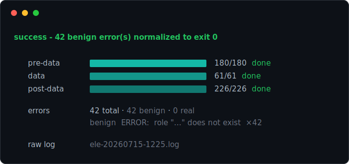

<p align="center">
  
</p>

<div align="center">

### Quiet the elephant.

A drop-in `pg_restore` wrapper that swaps its noisy stderr for live progress and a classified error summary.

[](https://github.com/amberpixels/ele/actions/workflows/ci.yml)
[](go.mod)
[](LICENSE)

</div>

---

`pg_restore --verbose` does the job, but it floods the terminal with thousands
of lines of stderr. Most of it is benign noise - `does not exist` during a
`--clean` run, missing roles from an RDS dump - and the one error that actually
matters scrolls past unseen. So people pipe it to `| tail`, or `|| true`, and
hope.

`ele` wraps the same command. It swallows the firehose and repaints a compact,
per-phase progress block in its place - pre-data, data, post-data - with an
error panel that groups and classifies what went wrong. The raw output is always
kept in a log file, and the exit code reflects whether any *real* error
happened, not just whether pg_restore was noisy.

> [!NOTE]
> Pre-1.0. The pipeline works end to end (live wrapper, error classification,
> exit-code normalization); an honest ETA is still to come.

## Install

### Homebrew (macOS)

```sh
brew install amberpixels/tap/ele
```

### go install

```sh
go install github.com/amberpixels/ele/cmd/ele@latest
```

Requires `pg_restore` on your `PATH`. Developed against PostgreSQL 17; other
versions likely work but aren't verified yet.

## Quick Start

`ele` is a drop-in replacement, not a pipe. Take your `pg_restore` command and
put `ele` where `pg_restore` was - every argument passes through untouched:

```sh
# before
pg_restore -j 4 -d myapp_dev --clean --no-owner latest.dump

# after (just swap the command name)
ele        -j 4 -d myapp_dev --clean --no-owner latest.dump
```

`ele` runs `pg_restore` for you (adding `--verbose` under the hood) and captures
its output, so there is nothing to pipe. While it runs it shows a live status
block; when it finishes it prints a summary that survives scrollback:

<p align="center">
  
</p>

The exit code is `0` because every error was benign - this is what replaces the
`|| true` hack in restore scripts. A real (unclassified) error keeps a nonzero
exit and shows in red.

## Modes

```sh
ele <pg_restore args>       # run a restore live (the drop-in wrapper)
ele --plan <plan>           # print the parsed plan and exit; touches no database
ele --replay <plan> <log>   # replay a captured stderr log through the live view
```

`--plan` and `--replay` are offline: they never connect to a database. For both,
`<plan>` is either a dump or a saved `pg_restore -l` listing (see below).

`--replay` is the safe dry-run. Feed it a captured stderr log and a plan, and it
reruns the whole pipeline: on a terminal it drives the real live block (progress,
the current-object line, spinner, error panel) paced over a few seconds, then
prints the summary; elsewhere it prints the summary alone. The exit code reflects
the log's verdict, so it also answers "was that restore actually clean?".

Saving the listing once lets you dry-run (or re-`--plan`) without the dump on hand:

```sh
pg_restore -l latest.dump > latest.toc      # capture the plan once (no database)
ele --replay latest.toc ele-20260719.log    # replay any captured log against it
```

Tune the animation length with `ELE_REPLAY_SECONDS` (default 12; `0` feeds
instantly and just prints the summary).

## How It Works

- **Preflight** runs `pg_restore -l` (under `LC_ALL=C`) and parses the table of
  contents into exact per-phase denominators - not estimates. The phases are
  PostgreSQL's own restore sections (`pg_restore --section`): **pre-data**
  (schema, tables, functions), **data** (rows), and **post-data** (indexes,
  constraints, triggers), replayed in that order. The section isn't printed in
  the listing, so `ele` reconstructs it from each object's type the same way
  `pg_dump` assigns it. Directory-format dumps also get byte totals.
- **Run** spawns the real `pg_restore` with `--verbose` forced on, streams its
  stderr line by line, and tees every raw line to the log file. stdout is passed
  through untouched.
- **Parse & aggregate** turn that stream into progress and grouped errors,
  surviving the way parallel (`-j`) workers interleave their output. Errors are
  fingerprinted (quoted identifiers blanked) and classified benign or real.
- **Exit code** is normalized: if every error was benign, `ele` exits `0` with a
  note; any real error exits nonzero. Set `ELE_STRICT_EXIT=1` to keep
  pg_restore's raw code.

## Configuration

Configuration is environment variables only - no flags, so there's zero
collision with pg_restore's own flag surface.

| Variable | Effect |
|---|---|
| `ELE_STRICT_EXIT=1` | Don't normalize the exit code; return pg_restore's own. |
| `NO_COLOR=1` | Disable color. |
| `ELE_PLAIN=1` | Disable the repaint block; emit periodic one-line progress instead. |

`ele` also drops to plain output automatically when stderr isn't a terminal, or
under `CI` / `CLAUDECODE`.

## Feedback

`ele` is a solo, opinionated project - but if you stumbled upon it and have
ideas, questions, or bug reports, an [issue](https://github.com/amberpixels/ele/issues) is always welcome :)

## License

[MIT](LICENSE) © [amberpixels](https://amberpixels.io)
